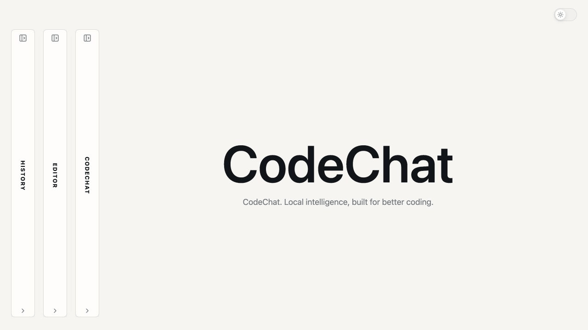
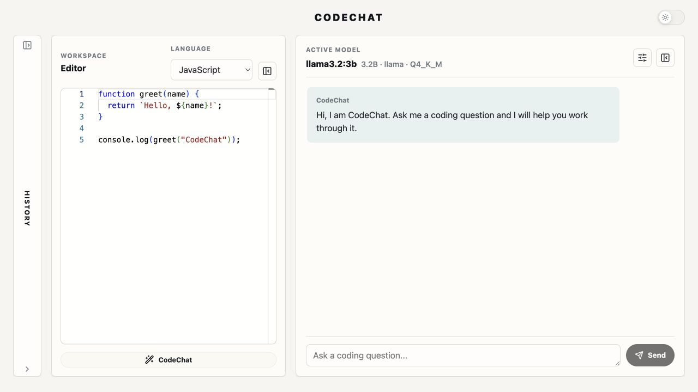
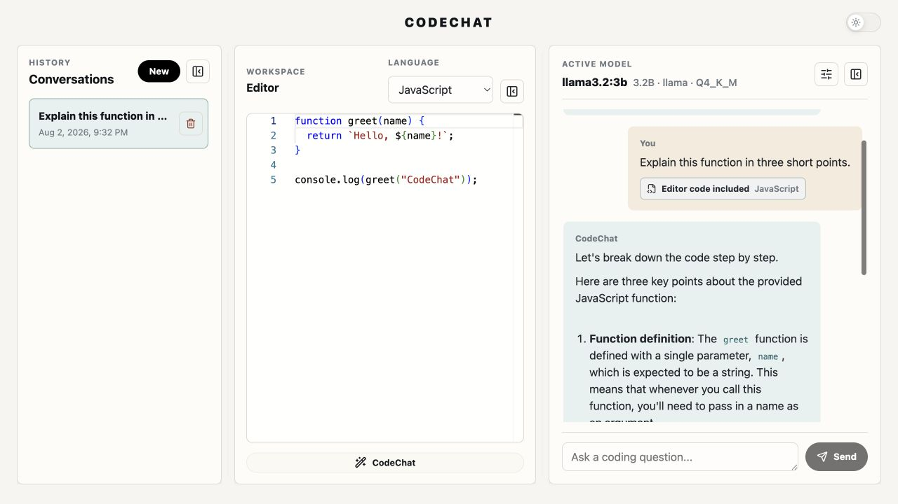

# CodeChat

**A private, locally powered AI workspace for understanding, reviewing, and writing code.**

CodeChat keeps an editor and an AI conversation side by side. Ask a general programming question, discuss the code currently in the editor, or continue a saved conversation without repeatedly pasting the same source.

The AI runs through [Ollama](https://ollama.com/) on your computer, and conversation history is stored in your local PostgreSQL database.



## A code conversation at a glance

| Editor and chat workspace | Code-aware response with local history |
| --- | --- |
|  |  |

## Why CodeChat?

- **Code-aware conversations:** ask “What does this code do?” and CodeChat includes the current editor source when it is relevant.
- **Three focused modes:** learn with Code Teacher, inspect code with Code Reviewer, or create with Code Generator.
- **Local model selection:** choose only from Ollama models that are actually installed on your computer.
- **Useful editor defaults:** start quickly with JavaScript, TypeScript, Python, HTML, or CSS.
- **Persistent follow-ups:** reopen local conversations and continue with their earlier messages and code context.
- **Responsive streaming:** read answers as they arrive, stop generation, and scroll without fighting automatic movement.

## Quick start

### 1. Install the prerequisites

You need:

- [Node.js](https://nodejs.org/) 20 or newer
- [PostgreSQL](https://www.postgresql.org/download/)
- [Ollama](https://ollama.com/download)

Confirm Node.js is ready:

```bash
node --version
npm --version
```

### 2. Download and install CodeChat

```bash
git clone https://github.com/jimmyli-520/codechat.git
cd codechat
npm install
```

### 3. Create the local database

Create a PostgreSQL database named `codechat` in pgAdmin, or run:

```bash
createdb -U postgres codechat
```

If PostgreSQL says the database already exists, continue to the next step.

### 4. Run the guided setup

```bash
npm run setup
```

On its first run, setup creates `server/.env`. Open that file and replace these two example values with your local PostgreSQL login:

```text
PGUSER=your_postgres_username
PGPASSWORD=your_postgres_password
```

Run setup again:

```bash
npm run setup
```

Setup connects to PostgreSQL, creates the required tables and indexes, and checks whether Ollama is available. It never overwrites an existing `server/.env` file.

### 5. Install an Ollama model

If you do not already have a chat model installed, run:

```bash
ollama pull llama3.2:3b
```

You can use another installed chat model instead. CodeChat discovers the local model list automatically.

### 6. Start CodeChat

```bash
npm run dev
```

Open [http://localhost:5173](http://localhost:5173). Keep this terminal running while using the app.

## Using CodeChat

1. Open **Editor** and choose a language.
2. Add or edit source code.
3. Open **CodeChat**, enter a question such as “Explain this function,” and send it. Questions that refer to the editor show an **Editor code included** indicator.
4. Use **CodeChat** below the editor when you always want to attach the current source. If the question is empty, the selected mode supplies a suitable code-focused prompt.
5. Open **History** to resume or permanently delete a saved conversation.

General programming questions do not attach editor code unless the question refers to it or the editor’s CodeChat action is used.

## Configuration

Local backend settings live in `server/.env`:

```text
PGHOST=localhost
PGPORT=5432
PGDATABASE=codechat
PGUSER=your_postgres_username
PGPASSWORD=your_postgres_password
OLLAMA_BASE_URL=http://localhost:11434
HOST=127.0.0.1
PORT=3001
CORS_ORIGINS=http://localhost:5173,http://127.0.0.1:5173
```

You can use `DATABASE_URL` instead of the individual PostgreSQL settings. The local `.env` file is ignored by Git and must never be committed.

The default services are:

| Service | Address |
| --- | --- |
| Frontend | `http://localhost:5173` |
| Backend | `http://localhost:3001` |
| Ollama | `http://localhost:11434` |
| PostgreSQL | `localhost:5432` |

## Troubleshooting

### PostgreSQL password authentication failed

Open `server/.env` and confirm that `PGUSER` is a PostgreSQL role—not necessarily your computer username—and that `PGPASSWORD` is that role’s password. A common local configuration uses `PGUSER=postgres`. Then run `npm run setup` again.

### PostgreSQL is unavailable

Make sure the PostgreSQL service is running and that the `codechat` database exists. Setup reports the host, port, and database it attempted without printing your password.

### Ollama is unavailable

Open the Ollama desktop application or start its service with:

```bash
ollama serve
```

Then use **Refresh** in CodeChat’s model settings.

### No local models are available

Check the installed inventory and download a model:

```bash
ollama list
ollama pull llama3.2:3b
```

### A development port is already in use

Close the other CodeChat development terminal, or stop the process using port `5173` or `3001`, and run `npm run dev` again.

## Privacy and local security

With the default configuration, the backend binds to `127.0.0.1`, accepts browser requests only from the configured local frontend origins, talks to local Ollama, and stores chats in local PostgreSQL.

Setting `HOST=0.0.0.0`, changing `OLLAMA_BASE_URL` to a remote service, or using a remote `DATABASE_URL` expands that boundary. Only make those changes on systems and networks you trust.

## Development commands

| Command | Purpose |
| --- | --- |
| `npm run setup` | Create local configuration, initialize the database schema, and check Ollama |
| `npm run dev` | Start the frontend and backend together |
| `npm run dev:client` | Start only the Vite frontend |
| `npm run dev:server` | Start only the Express backend |
| `npm test` | Run all automated tests |
| `npm run typecheck` | Type-check both workspaces |
| `npm run build` | Create frontend and backend production builds |

For a reproducible dependency installation in CI or a clean checkout, use `npm ci`.

## Technology

CodeChat uses React, TypeScript, Vite, Monaco Editor, Express, Ollama, and PostgreSQL. It is organized as npm workspaces under `client/` and `server/`.

For component boundaries, request and streaming flows, persistence, security assumptions, design tradeoffs, and known limitations, see [CodeChat 2.0 architecture](docs/ARCHITECTURE.md).
