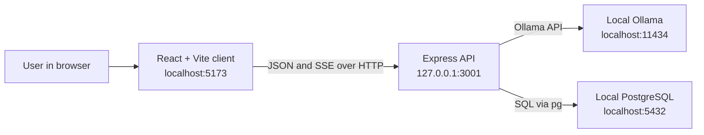
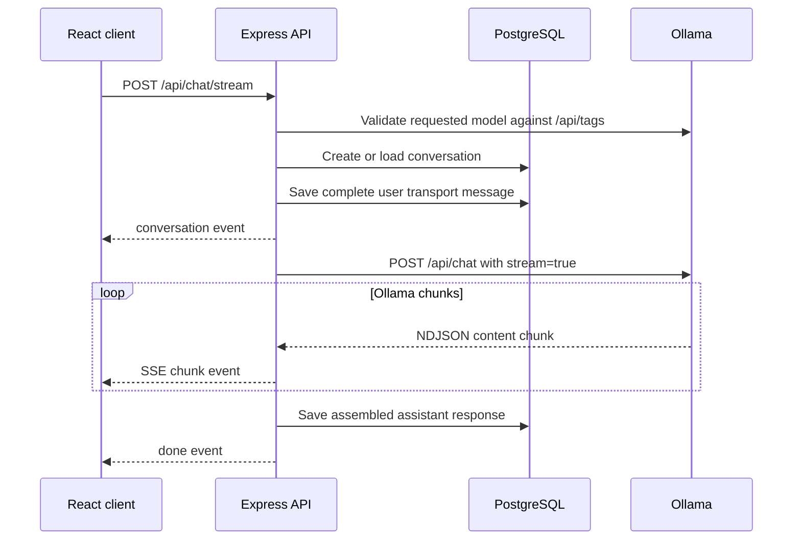

# CodeChat 2.0 architecture

This document describes how CodeChat 2.0 works today, why its major implementation choices were made, and where its boundaries are. It is intended for contributors and maintainers; the user-focused installation and workflow guide remains in the [README](../README.md).

## System overview

CodeChat is a local-first web application with three runtime services:



- The **client** owns the workspace UI, editor state, model and mode selection, message presentation, and streaming animation.
- The **server** validates browser origins and model requests, builds model prompts, streams Ollama output, and coordinates persistence.
- **Ollama** provides the installed-model inventory and AI inference.
- **PostgreSQL** stores conversations and messages.

The browser never connects directly to PostgreSQL or Ollama. All access crosses the Express API so validation, prompt construction, error handling, and persistence have one server-side boundary.

## Repository layout

```text
client/
  src/components/       Workspace panels and controls
  src/services/api.ts   Browser API client
  src/store/            State, workflows, and pure behavior helpers
server/
  src/config/           Environment and startup support
  src/db/               PostgreSQL pool and schema
  src/ollama/           Installed-model discovery and validation
  src/routes/           Express API routes
  src/app.ts            API composition and CORS boundary
  src/index.ts          Startup and database readiness check
docs/
  assets/               README screenshots and demo
```

The repository uses npm workspaces. Root commands run the `client` and `server` packages together.

## Client architecture

### Workspace and state

`client/src/App.tsx` composes four workspace areas:

- History sidebar
- Monaco editor
- CodeChat conversation
- Initial welcome view

`client/src/store/store.ts` currently acts as the application controller. Its `useCodeChatStore` hook owns UI state and coordinates asynchronous workflows such as model refresh, conversation loading, streaming, cancellation, and history refresh.

Browser requests are centralized in `client/src/services/api.ts`, which validates an optional API base URL, normalizes backend errors, and exposes the conversation, model, and streaming operations used by the store.

Small behavior modules under `client/src/store/` keep important rules testable without rendering the full application. Examples include editor-context selection, starter-code preservation, keyboard behavior, model reconciliation, stream-event handling, and scroll-following decisions.

### Deferred dependencies

The initial page does not load editor-only or rich-message dependencies immediately:

- `@monaco-editor/react` loads when the editor panel opens.
- Markdown and syntax-highlighting packages load when formatted message content is needed.
- Plain user messages remain on a lightweight rendering path.

This keeps the initial JavaScript payload substantially smaller while retaining the existing panels and controls.

### Editor context policy

The client decides whether a message should contain current editor code:

1. The editor’s **CodeChat** action always includes non-empty editor code.
2. A composer question includes code when it clearly refers to the current code, function, component, or editor.
3. An unrelated general question does not include editor code.
4. Follow-up messages rely on the earlier request stored in conversation history unless current code is attached again.

The transport message contains an explicit marker and fenced source block. The UI converts that transport representation into the user’s visible question plus an **Editor code included** label. The original transport content remains available for model history and saved-conversation reloads.

## Server architecture

`server/src/app.ts` composes middleware and API routers, while `server/src/index.ts` performs startup readiness checks and begins listening only after PostgreSQL is prepared.

### API surface

All endpoints are mounted below `/api`:

| Method and path | Purpose |
| --- | --- |
| `GET /health` | Confirm that the Express service is responding |
| `GET /models` | Return locally installed Ollama models |
| `GET /conversations` | List saved conversations, newest activity first |
| `POST /conversations` | Create an explicit empty conversation |
| `GET /conversations/:id` | Load a conversation and its ordered messages |
| `DELETE /conversations/:id` | Permanently delete a conversation and its messages |
| `POST /chat` | Generate a non-streamed response fallback |
| `POST /chat/stream` | Run the primary streamed conversation workflow |

Route factories accept optional dependency adapters. Production uses the PostgreSQL, Ollama, and global fetch implementations. Automated integration tests inject in-memory persistence and deterministic Ollama responses.

### Streamed conversation flow



The client buffers incoming chunks and presents them in bounded visual frames. It follows the response only while the message viewport is near the bottom. Cancelling aborts the browser request; the server then aborts its Ollama request when the response connection closes.

### Prompt construction

The server, not the browser, owns system prompts. It selects the Code Reviewer, Code Teacher, or Code Generator instruction and adds an explicit conversation-context instruction for one of three cases:

- a genuinely new conversation;
- a follow-up containing saved history;
- a message containing current editor code.

Requested model names are accepted only when they exactly match the current installed Ollama inventory. If no model is requested, the server prefers `llama3.2:3b` when installed and otherwise uses the first installed model.

## Persistence

`server/src/db/schema.sql` defines two tables:

- `conversations` stores title, model, persona, and timestamps;
- `messages` stores ordered user, assistant, and system content linked to a conversation.

Deleting a conversation cascades to its messages. The server runs the idempotent schema during guided setup and verifies it again before announcing backend readiness.

Conversation messages store the full model transport content. For editor-aware user messages, this includes the source block even though the UI displays a compact context label.

## Configuration and security boundary

`server/src/config/loadEnv.ts` loads `server/.env` without overwriting environment variables already supplied by the process. Important defaults are intentionally local:

- backend host: `127.0.0.1`;
- trusted browser origins: Vite on `localhost:5173` and `127.0.0.1:5173`;
- Ollama: `localhost:11434`;
- PostgreSQL: `localhost:5432/codechat`.

CORS uses exact origin matching. Origin-less requests remain available to local command-line tools. The setup and startup errors describe the database target without printing its password.

These controls reduce accidental network exposure; they are not an authentication or authorization system.

## Testing strategy

The project uses Node’s built-in test runner with TypeScript execution through `tsx`:

- **Pure behavior tests** cover client and server decision rules.
- **Route and security tests** cover model validation, prompt context, configuration, and origins.
- **Core-flow integration testing** starts an ephemeral Express server with an in-memory repository and mock Ollama stream. It covers health, model discovery, a first code-aware question, SSE delivery, persistence, history reload, and deletion.
- **Documentation and bundle-boundary tests** protect setup instructions, visual assets, and lazy-loading architecture.

Production builds and TypeScript checks run for both workspaces.

## Design tradeoffs

| Choice | Benefit | Cost |
| --- | --- | --- |
| Local Ollama inference | User controls the model and code does not need a hosted AI provider | Installation, model downloads, memory use, and response quality depend on the local machine |
| PostgreSQL persistence | Durable relational history and straightforward querying | A database service and credentials are required for a desktop-style local app |
| Single React controller hook | Related workflow behavior is easy to trace in one place | `store.ts` is large and will become harder to maintain as features grow |
| Heuristic editor references | General questions avoid sending unrelated editor code | Natural-language intent detection can miss unusual wording or attach code unexpectedly |
| Full history sent by the client | Follow-ups retain prior messages and earlier code | Long conversations have no token-budgeting or summarization strategy |
| SSE over HTTP | Simple incremental browser delivery and cancellation | The protocol is one-way and reconnection/resume is not implemented |
| Idempotent SQL schema | Setup stays small and can be rerun safely | There is no versioned migration system for future schema changes |
| Lazy editor and Markdown loading | Faster initial page load | The first editor or rich-message opening may briefly show a loading state |

## Current limitations

- CodeChat is designed for one trusted local user. It has no accounts, authentication, authorization, or multi-user isolation.
- Conversations are not encrypted by CodeChat at rest; database protection depends on the local PostgreSQL configuration and device security.
- Editor content is entered manually. CodeChat does not open project folders, read files from disk, execute code, run tests, or apply model-generated edits.
- Conversation history is sent without token counting, truncation, summarization, or model-specific context-window management.
- Cancelling may leave the already-saved user message in history; a partial assistant response shown before cancellation is not guaranteed to be persisted.
- Model discovery lists Ollama inventory metadata but does not currently distinguish chat models from embedding-only models.
- The Monaco loader may retrieve editor runtime assets from its configured CDN on first use. The application API, model inference, and chat persistence remain local under the default configuration, but fully offline editor packaging is not yet implemented.
- The health endpoint confirms the Express process only. It does not currently report PostgreSQL or Ollama readiness.
- PostgreSQL schema changes do not have migrations or rollback support.
- There is no packaged desktop binary, container setup, hosted deployment configuration, telemetry, import/export, backup workflow, or automatic update mechanism.
- The frontend has behavior and integration coverage but does not yet use a browser-based end-to-end suite in CI.

## Safe extension points

- Add a repository/service module when splitting `useCodeChatStore`; keep pure decision logic independently tested.
- Add new personas server-side so prompt authority remains outside the browser.
- Preserve exact installed-model validation when adding model capabilities or filtering.
- Introduce versioned migrations before changing persisted columns or constraints.
- Keep editor context explicit in transport messages and visually identifiable in the UI.
- Extend the injected route dependencies for new core-flow tests rather than connecting automated tests to a developer’s real services.
